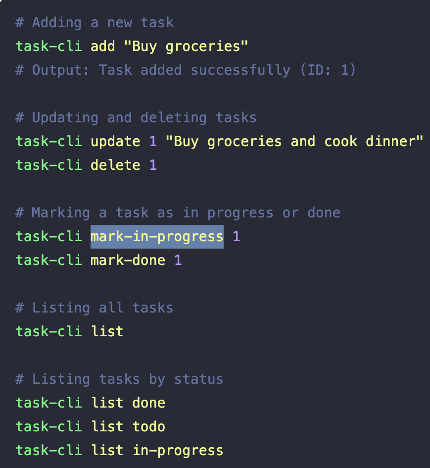

# CLI Task

Task tracker is a project used to track and manage your tasks. In this task, I built a simple command line interface (CLI) to track what you need to do, what you have done, and what you are currently working on. The project utilizes Typescript for type safety.


## Installation

To get started with this project, follow these steps:
1. CLone the repository, you can use http or SSH, 
```bash
    git clone <use the SSH or HTTPS URL>
    cd my-project
```

2. Navigate to your repository.
```bash
    cd task-tracker
```

3. Install the dependencies on your local machine, then install globally. Make sure you have Nose.js installed.
```bash
    npm install
    npm install -g . // to install the bin in package.json
```
You should also run your typescript configuration for TS transpilation
```bash
    tsc
```
This will genearate a dist folder where your transpilled TS will be.

4. You can start the project with:
```bash
    task-cli <argument> [optional id argument]
```
In the ``<argument>``, these are compulsory commands, they include ``add``, ``update``, ``delete``, ``mark-in-progress``, ``mark-done`` and ``list``.
In the ``[optional id argument]`` the arguments can be any id number from the task entry.

The update argument takes an extra argument ``task-cli update <optional id argument> <string argument>``, the string argument should be provided to updated a task.

## Usage

Here is a basic example of how the project works;
```bash
task-cli update 1 "Buy groceries and cook dinner"
```

these positional argements updates a task, with an id of 1, from your db.json file.

## Screenshots



## Badges

Add badges from somewhere like: [shields.io](https://shields.io/)


